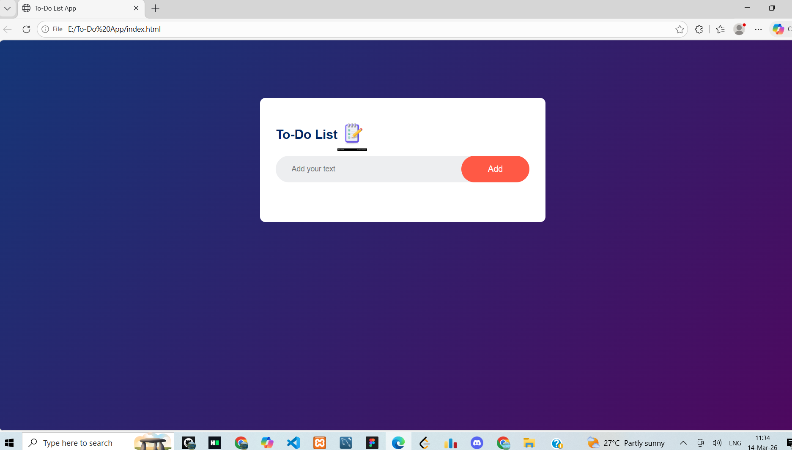
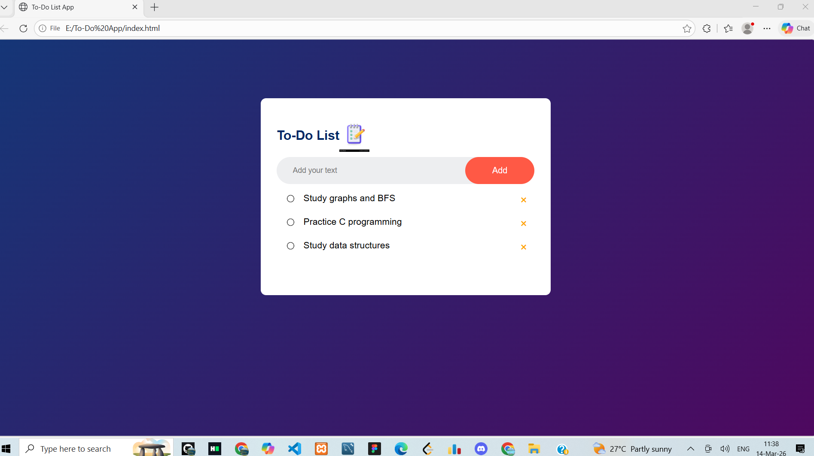
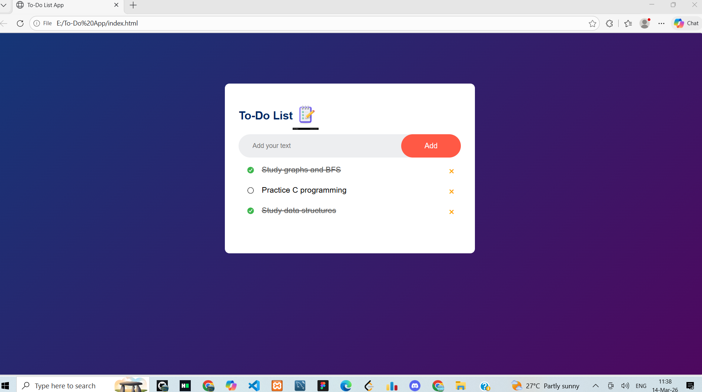

# 📝 To-Do List Web App

A simple and interactive **To-Do List Application** built using **HTML, CSS, and JavaScript**.  
This project allows users to add tasks, mark them as completed, delete tasks, and automatically save tasks using **Local Storage**, so tasks remain even after refreshing the page.

---

## 🚀 Features

- ➕ Add new tasks
- ✅ Mark tasks as completed
- ❌ Delete tasks
- 💾 Tasks are saved automatically using **Local Storage**
- 🎨 Clean and simple user interface
- ⚡ Fast and lightweight (pure JavaScript)

---

## 🛠 Technologies Used

- **HTML5** – Structure of the application  
- **CSS3** – Styling and layout  
- **JavaScript (Vanilla JS)** – Application logic and interactivity  
- **Local Storage API** – Saves tasks in the browser

---

## 📂 Project Structure

```
To-Do-App
│
├── index.html
├── style.css
├── script.js
│
└── images
    ├── checked.png
    ├── unchecked.png
    └── todo-icon.png
```


---

## ⚙️ How the Application Works

1. User enters a task in the input field.
2. Clicking the **Add** button creates a new task.
3. Clicking a task marks it as **completed**.
4. Clicking the **× button** deletes the task.
5. Tasks are stored in **Local Storage**, so they remain even after refreshing the page.

---

## 💻 How to Run This Project

1. Clone the repository:
git clone https://github.com/Israt-Art/To-Do-List-App.git

2. Open the project folder.

3. Run the project by opening **index.html** in any web browser.

---

## 📸 Screenshots

### 🖥️ App Interface


### ➕ Adding Tasks


### ✅ Completed Task


---

## 📈 Future Improvements

- ✏️ Edit existing tasks
- 📅 Add deadlines to tasks
- 🌙 Dark mode
- 📱 Mobile responsive improvements
- 🔔 Reminder notifications

---

## 👩‍💻 Author

**Israt Jahan**  
Student – Data Science Major  
Interested in **Web Development, Software Development, and Data Science**

---

⭐ If you like this project, feel free to **star the repository**.
